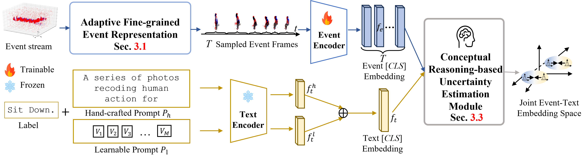
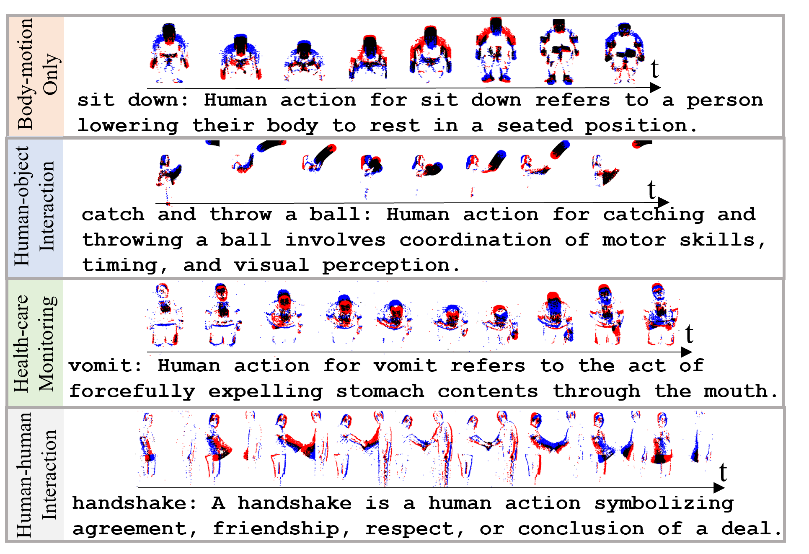

# [🌟CVPR2024 Highlight🌟]ExACT: Language-guided Conceptual Reasoning and Uncertainty Estimation for Event-based Action Recognition and More

This repository contains the official PyTorch implementation of the paper "ExACT: Language-guided Conceptual Reasoning and Uncertainty Estimation for Event-based Action Recognition and More".
| [Page](https://vlislab22.github.io/ExACT/) | [Paper](https://arxiv.org/abs/2403.12534)

<div align="center">

</div>

---
# Citation
If you find this paper useful, please consider staring 🌟 this repository and citing 📑 our paper:
````
@inproceedings{zhou2024exact,
  title={ExACT: Language-guided Conceptual Reasoning and Uncertainty Estimation for Event-based Action Recognition and More},
  author={Zhou, Jiazhou and Zheng, Xu and Lyu, Yuanhuiyi and Wang, Lin},
  booktitle={Proceedings of the IEEE/CVF Conference on Computer Vision and Pattern Recognition},
  pages={18633--18643},
  year={2024}
}
````

---
# Quick Start

1. Refer to [install.md](./docs/install.md) for step-by-step guidance on how to install the packages.
2. Download the **ViT-B-16** CLIP pretrained backbone in this [repository](https://github.com/mlfoundations/open_clip).
3. Download the evaluated dataset and its corresponding model checkpoints in the following **SeAct Dataset** section and **Model Checkpoints** section, respectively.
Note that the train-val dataset split are provided in **./ExACT/Dataloader** folder to ensure the fairness of future comparison.
4. Preprocess the datasets in order to transform the raw events into the event frames by our proposed 🌟AFE representation🌟. 
Also remember to change your dataset directory path in **dataset_name.py**.

````
python ./ExACT/Dataloader/AFE Preprocessing/dataset_name.py
````
5. Change the **dataset_name.yaml** file in the **Configs** folder, namely modifying **config['MODEL']['Load_Path'],
config['MODEL']['BACKBONE']['PRE_trained_model'], config['Dataset']['Train']['Path'], config['Dataset']['Val']['Path'], and  config['Dataset']['Classnames']**.
6. Finally, evaluate the ExACT using the following command!
````
python ./ExACT/evaluate_dp_dataset_name.py
````


---
# SeAct Dataset

SeAct Dataset: Event action dataset with caption-level labels
We propose the semantic-abundant SeAct dataset for event-text action recognition, where the detailed caption-level label of each action is provided. 
SeAct is collected with a DAVIS346 event camera whose resolution is 346 × 260. 
It contains 58 actions under four themes, as presented in the following images. 
Each action is accompanied by an action caption of less than 30 words generated by GPT-4 to enrich the semantic space of the original action labels. 
We split 80% and 20% of each category for training and testing (validating), respectively.

<div align="center">

</div>

The following table provides the Download Access to our SeAct dataset, as well as PAF, DVS128Gesture and HARDVS datasets utilized for comparision.

<div align=center>

| Event Datasets |                        Access to Download Datasets                                                                | 
|:--------------:|:-----------------------------------------------------------------------------------------------------------------:|
|     SeAct      |        [Download](https://drive.google.com/file/d/1AO8KGzFT6784kiW2OzAgi0a-jqmzl-x6/view?usp=sharing)        |  
|      PAF       |                            [Download](https://github.com/CrystalMiaoshu/PAFBenchmark)                             | 
| DVS128Gesture  |    [Download](https://research.ibm.com/publications/a-low-power-fully-event-based-gesture-recognition-system)     |
|     HARDVS     |                                  [Download](https://github.com/Event-AHU/HARDVS)                                  |

</div>

---
# Model Checkpoints
<div align=center>

|  Datasets     |                                            Access to Download Model checkpoints                                       | 
|:-------------:|:---------------------------------------------------------------------------------------------------------------------:|
|     SeAct     | [Download Model checkpoints](https://drive.google.com/file/d/1REmUPrCvKt7gaC81NT7Qv1SGtdN5dNAr/view?usp=sharing) |  
|      PAF      |  [Download Model checkpoints](https://drive.google.com/file/d/1VfvpqMEyj3oubFBPIAkOG2XlSF298Etu/view?usp=sharing)  | 
| DVS128Gesture |  [Download Model checkpoints](https://drive.google.com/file/d/1Kpk-6fR-4-E3Mrwn5DeN1NHerQfYsvx6/view?usp=sharing)  |
|    HARDVS     |  [Download Model checkpoints](https://drive.google.com/file/d/1yd5EViMTvVuTyScniluILj5F1vpH7XGA/view?usp=sharing)  |

</div>

---
# ️ ️Acknowledgement
We thank the authors of [EventBind](https://github.com/jiazhou-garland/EventBind), [MAP](https://github.com/IIGROUP/MAP) for opening source their wonderful works.

---
# License
This repository is released under the [MIT](LICENSE) License.

---
# Contact
If you have any question about this project, please feel free to contact jiazhouzhou@hkust-gz.edu.cn.
